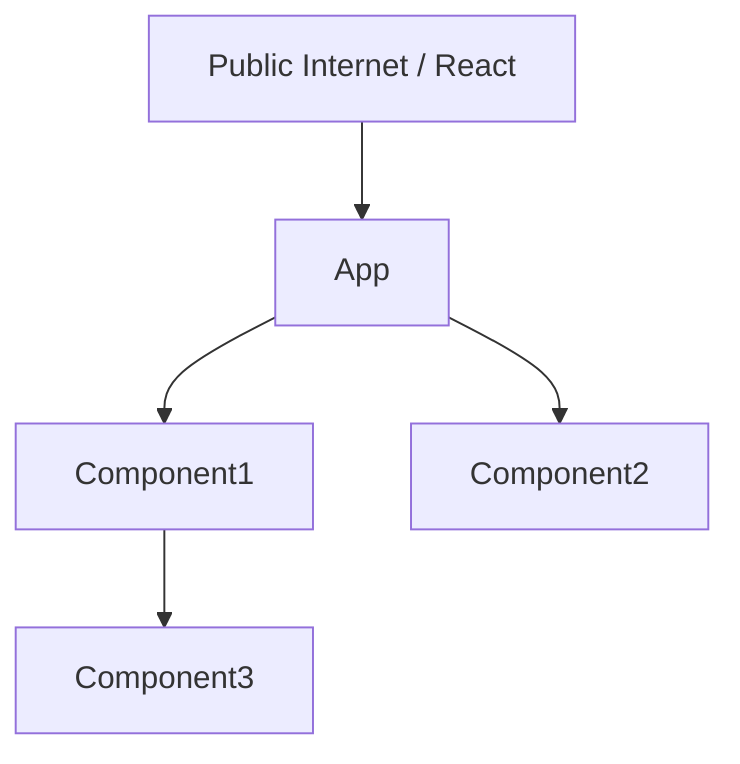

# 🔨 Convex Component Template

[](https://pkg.pr.new/~/OWNER/REPO)

A modern template for building reusable [Convex components](https://www.convex.dev/components) with Bun, TypeScript, and comprehensive testing.

> **Note:** Replace `OWNER/REPO` in the badge above with your GitHub username/organization and repository name once you set up your repository.

## Getting Started

### 1. Rename Your Component

After cloning this template, run the rename script to customize it for your component:

```bash
bun rename.ts
```

The script will:
- Prompt you for your component name (e.g., "document search", "rate limiter")
- Ask for your NPM package name (default: `@samhoque/your-component-name`)
- Ask for your GitHub repository (default: `samhoque/your-component-name`)
- Automatically generate all case variants (PascalCase, camelCase, kebab-case, etc.)
- Replace all template placeholders across the entire codebase
- Update `package.json` with your package name
- Optionally delete itself when done

**What gets renamed:**
- Package name in `package.json`
- All imports and references throughout the codebase
- Component class names, function names, and identifiers
- Documentation examples in README and comments

### 2. Install Dependencies & Start Development

```bash
bun install
cd example && bun install && cd ..
bun run dev:backend
```

Then in another terminal:
```bash
cd example
bun run dev
```

## What are Convex Components?

Components are isolated, reusable units of Convex functionality with their own:
- Functions (queries, mutations, actions)
- Tables and schemas
- File storage
- Scheduled functions

Components plug into Convex apps (or parent components) through a public interface, enabling modular architecture with proper isolation and security.

## Project Structure

```
src/
  component/               # The Convex component source code
    convex.config.ts       # Component configuration (exported via package.json)
    schema.ts              # Convex schema definition
    lib.ts                 # Component functions (queries, mutations)
    _generated/            # Auto-generated Convex types (gitignored)

  client/                  # Optional: Client library that runs in the app
    index.ts               # Helper class for easier component interaction

  react/                   # Optional: React components for UI
    index.tsx              # React hooks and components

test/
  component/               # Component tests (separate from source)
    setup.test.ts          # Test setup with module auto-discovery
    *.test.ts              # Unit tests for the component

example/
  convex/                  # Example app that uses the component
    convex.config.ts       # Example app configuration
    schema.ts              # Example app schema
    _generated/            # Auto-generated types (gitignored)
  src/                     # Example app frontend
```

## Key Commands

### Development
```bash
bun run dev:backend          # Start Convex dev with live component sources
bun run build                # Build the component for distribution
```

### Testing
```bash
bun test                     # Run all tests
bun test --watch             # Watch mode
bun test --coverage          # Generate coverage reports
bun test -t "pattern"        # Filter tests by name
CLAUDECODE=1 bun test        # AI-friendly quiet output
```

### Linting and Formatting
```bash
bun run lint                 # Lint with Biome
bun run lint:fix             # Auto-fix linting issues
bun run format               # Format code with Biome
bun run check                # Run both lint and format checks
bun run check:fix            # Auto-fix all issues
```

### Git Hooks (Lefthook)

This project uses [Lefthook](https://github.com/evilmartians/lefthook) for Git hooks. Hooks are automatically installed when you run `bun install`.

**Pre-commit hook:**
- Runs Biome check on staged files
- Auto-fixes issues and stages the changes
- Prevents commits with linting/formatting errors

To skip hooks (not recommended):
```bash
git commit --no-verify
```

### CI/CD

The project includes a GitHub Actions workflow that runs on every push and pull request:

**Workflow: Test and lint** (`.github/workflows/test-and-lint.yml`)
- Installs dependencies with Bun
- Builds the project
- Publishes preview packages with `pkg.pr.new`
- Runs all tests
- Runs linting checks

The workflow ensures code quality and prevents broken builds from being merged.

#### pkg.pr.new Setup

This project uses [pkg.pr.new](https://github.com/stackblitz-labs/pkg.pr.new) for continuous package previews. Each commit and PR automatically generates a preview release that can be installed without publishing to npm.

**One-time setup required:**
1. Install the [pkg.pr.new GitHub App](https://github.com/apps/pkg-pr-new) on your repository
2. Once installed, the workflow will automatically publish preview packages on every commit/PR

**Using preview packages:**
```bash
# Install from a specific commit (Bun)
bun add https://pkg.pr.new/OWNER/REPO/@samhoque/convex-component-template@COMMIT_SHA

# Or with npm
npm i https://pkg.pr.new/OWNER/REPO/@samhoque/convex-component-template@COMMIT_SHA
```

Preview URLs will be posted as comments on your pull requests automatically.

## Component Architecture

### 1. Component Definition

The component is defined in `src/component/convex.config.ts`:

```typescript
import { defineComponent } from "convex/server";
import { api } from "./_generated/api";

const component = defineComponent("shardedCounter"); // Change "shardedCounter" to your component name
component.export(api, { greet: api.lib.greet });
export default component;
```

### 2. Package Exports

The `package.json` exports the component using the `@convex-dev/component-source` condition:

```json
{
  "exports": {
    "./convex.config": {
      "@convex-dev/component-source": "./src/component/convex.config.ts"
    }
  }
}
```

This enables live reloading during development.

### 3. Component Usage

Apps import and mount the component in their `convex.config.ts`:

```typescript
import { defineApp } from "convex/server";
import component from "@your-package/convex.config";

const app = defineApp();
app.use(component);
export default app;
```

### 4. Client Library (Optional)

The `src/client/` directory contains helper code that runs in the app (not the component):

```typescript
export class Counter {
  constructor(
    private component: UseApi<typeof api>,
    private options?: { initialValue?: number }
  ) {}

  async count(ctx: RunQueryCtx) {
    return await ctx.runQuery(this.component.public.count, {});
  }
}
```

This pattern is useful for:
- Hiding implementation details
- Managing implicit dependencies (auth, env vars)
- Providing a cleaner API surface

## Calling Component Functions

### Subtransactions

Components use **subtransactions** for cross-component function calls:

```typescript
// From the app or parent component
const count = await ctx.runQuery(components.counter.public.count, args);
const newCount = await ctx.runMutation(components.counter.public.increment, args);
```

**Key semantics:**
1. Sub-queries track reads for reactivity across components
2. Sub-mutations contribute to the parent's ACID transaction
3. Sub-mutations are isolated from each other (even with `Promise.all`)
4. Parent errors roll back sub-mutations
5. Sub-mutation errors can be caught without affecting parent

### Exposing Component Functions Publicly

Components cannot be called directly from clients. The app must wrap them:

```typescript
// in the app's convex/counter.ts
export const count = query({
  handler: async (ctx) => {
    return await ctx.runQuery(components.counter.public.count, {});
  },
});
```

This allows the app to add auth, rate limiting, etc.

## Working with Isolation

### Function Access Hierarchy



- Clients can only call app functions (not component functions)
- Apps can call their own functions and component public functions
- Components can only call their own functions and child component public functions

### Function Handles

To allow components to call back into the app, use function handles:

```typescript
// In the app
const handle = await createFunctionHandle(api.myMutation);

// Pass handle to component
await ctx.runMutation(components.worker.public.process, { handler: handle });

// In the component
export const process = mutation({
  args: { handler: v.string() },
  handler: async (ctx, args) => {
    // Component can now call the app's function
    const functionHandle: FunctionHandle<"mutation"> = args.handler;
    await ctx.runMutation(functionHandle, {});
  },
});
```

**Use cases:**
- Migrations component iterating over app tables
- Webhook handlers calling app logic
- Background job processors

### Table Access

Components have **isolated tables**:
- Components can only read/write their own tables
- Use `v.id("tableName")` for component tables
- Use `v.string()` for IDs from other components/app
- Use function handles to grant table access across boundaries

### Environment Variables and Auth

Components **cannot access** `process.env` or `ctx.auth` directly. Pass them through:

```typescript
// src/client/index.ts (runs in app context)
class MyComponent {
  constructor(
    private component: UseApi<typeof api>,
    private options?: { apiKey?: string }
  ) {
    this.apiKey = options?.apiKey ?? process.env.MY_API_KEY;
  }

  async doSomething(ctx: QueryCtx) {
    return await ctx.runQuery(this.component.public.process, {
      apiKey: this.apiKey,
      auth: await ctx.auth.getUserIdentity(),
    });
  }
}
```

### HTTP Actions

Components cannot define HTTP routes directly. Instead, they export handlers that the app mounts:

```typescript
// src/client/index.ts
export const httpHandler = httpAction(async (ctx, request) => {
  // Handle HTTP request
});

// In app's convex/http.ts
import { httpRouter } from "convex/server";
import { httpHandler } from "@your-component/client";

const http = httpRouter();
http.route({ path: "/webhook", method: "POST", handler: httpHandler });
export default http;
```

### Pagination

The built-in `.paginate()` doesn't work in components. Use [`convex-helpers` paginator](https://github.com/get-convex/convex-helpers) instead:

```typescript
import { paginationOptsValidator } from "convex-helpers/server/pagination";
import { makePagination } from "convex-helpers/server/pagination";

export const listItems = query({
  args: { paginationOpts: paginationOptsValidator },
  handler: async (ctx, args) => {
    return await makePagination(ctx.db.query("items"), args.paginationOpts);
  },
});
```

## Testing Pattern

This template uses `convex-test` with Bun's test runner. Tests are **separate from component source** to prevent bundling issues.

### Test Setup (`test/component/setup.test.ts`)

Auto-discovers component files and creates a test helper:

```typescript
import { convexTest as baseConvexTest } from "convex-test";
import { Glob } from "bun";

const glob = new Glob("**/*.ts");
const modules: Record<string, string> = {};

for await (const file of glob.scan("./src/component")) {
  if (!file.startsWith("_generated/")) {
    modules[file.replace(/\.ts$/, ".js")] = await Bun.file(
      `./src/component/${file}`
    ).text();
  }
}

export const convexTest = () => baseConvexTest(schema, modules);
```

### Writing Tests

```typescript
import { test, expect } from "bun:test";
import { api } from "../../src/component/_generated/api";
import { convexTest } from "./setup.test";

test("greet returns greeting", async () => {
  const t = convexTest();
  const result = await t.query(api.lib.greet, { name: "Alice" });
  expect(result).toBe("Hello, Alice!");
});

test("with authentication", async () => {
  const t = convexTest();
  const asUser = t.withIdentity({ subject: "user123" });
  const result = await asUser.query(api.lib.getCurrentUser, {});
  expect(result.subject).toBe("user123");
});
```

## Distribution

### Local Development

To use the component in another app during development:

```bash
bun run build
bun pack  # or npm pack
```

Then in the other app:
```bash
bun install ../path/to/component/your-component-0.1.0.tgz
```

### Publishing

This package is currently marked as `private` in package.json. To publish to npm:

1. Remove `"private": true` from package.json
2. Run: `bun publish` (or `npm publish` if bun publish is not yet available)

## Dashboard and Deployment

### Component Visibility

In the Convex dashboard, you can select each component to see:
- Data tables
- Functions
- File storage
- Logs
- Scheduled functions

### Deployment Semantics

1. **Function calls**: Top-level query/mutation counts as single function call (sub-calls are free)
2. **Database bandwidth**: Component functions count bandwidth separately
3. **Logging**: Component logs appear in dashboard and log streams
4. **Exports**: Snapshot exports include all component data
5. **Streaming exports**: Only include top-level app data (not components)

## Code Style

- **Package manager**: Bun
- **Linter/Formatter**: Biome
- **Indentation**: Tabs
- **Quotes**: Double quotes
- **TypeScript**: Strict mode with extra checks

## Examples

### First-Party Components

All first-party components are open source:

- [sharded-counter](https://github.com/get-convex/sharded-counter) - Attaching components to app tables with triggers
- [twilio](https://github.com/get-convex/twilio) - HTTP actions and webhooks
- [aggregate](https://github.com/get-convex/aggregate) - Testing patterns
- [migrations](https://github.com/get-convex/migrations) - Function handles and table access

## Important Notes

- **Generated files**: Never edit `_generated/` directories
- **Test location**: Always place tests in `test/component/` (not `src/component/`)
- **Component name**: Change `"shardedCounter"` in convex.config.ts to your component name
- **Live reloading**: Enabled via `--live-component-sources` flag
- **Peer dependencies**: Component uses the app's Convex installation

## Resources

- [Convex Components Documentation](https://www.convex.dev/components)
- [Component Authoring Guide](https://docs.convex.dev/components/authoring)
- [convex-test](https://github.com/get-convex/convex-test)
- [convex-helpers](https://github.com/get-convex/convex-helpers)
- [Bun Documentation](https://bun.sh/docs)

## License

MIT
